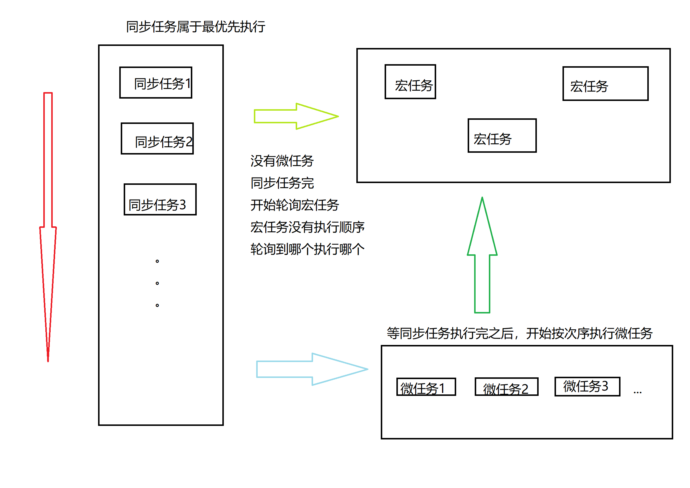
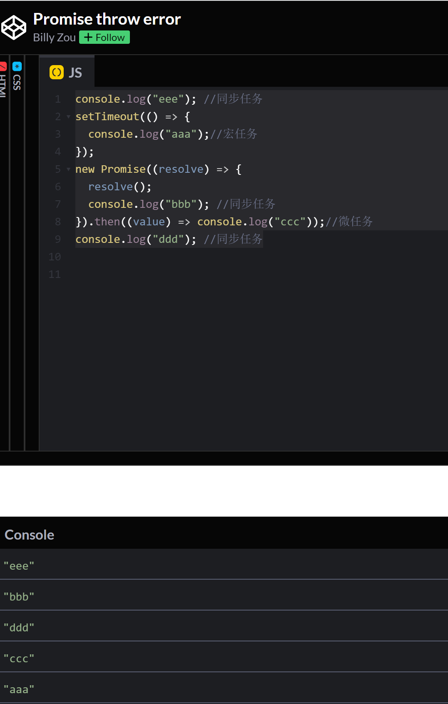

# js异步操作：Promise 与 async、await的原理以及使用

## js执行异步的顺序

同步操作=>微任务=>宏任务（不停的轮询）

```js
 
console.log("eee"); //同步任务
setTimeout(() => {
  console.log("aaa");//宏任务
});
new Promise((resolve) => {
  resolve();
  console.log("bbb"); //同步任务
}).then((value) => console.log("ccc"));//微任务
console.log("ddd"); //同步任务
```




## Promise 状态

**初始状态 -> pending** 

初始状态可以改变    
在resolve 或者 reject 调用之前都处于这个状态

**最终成功状态 -> fulfilled**

执行 resolve 函数，状态改变为 fulfilled     
执行 onFulfilled 函数

**最终失败状态 -> rejected**

执行 reject 函数，状态改变为 rejected       
执行 onRejected 函数

## Promise 常用方法

**then 方法**   
then 方法为 Promise 对象注册了 onFulfilled 和 onRejected 函数

```js
 
var p = new Promise(function (resolve, reject) {
            resolve('成功');
        });
        p.then(function(data){//状态为fulfilled时执行
            console.log(data);
            console.log('这是成功操作');
        },function(reason){ //状态为rejected时执行
            console.log(reason);
            console.log('这是失败的操作');
        });
/*
打印结果 
成功
这是成功操作
*/
```
```js
 
var p = new Promise(function (resolve, reject) {
            reject('失败');
        });
        p.then(function(data){//状态为fulfilled时执行
            console.log(data);
            console.log('这是成功操作');
        },function(reason){ //状态为rejected时执行
            console.log(reason);
            console.log('这是失败的操作');
        });
/*
打印结果 
失败
这是失败的操作
*/
```

**promise then方法链式调用**
```js
 
     let p = new Promise(function (resolve, reject) {
            resolve('1');
        });
        p.then((onfulfilled) => {
            console.log(onfulfilled);
            return new Promise(function (resolve, reject) {
                resolve('2');
            })
        }).then((onfulfilled) => {
            console.log(onfulfilled);
            return new Promise(function (resolve, reject) {
                resolve('3');
            })
        }).then((onfulfilled) => {
            console.log(onfulfilled);
        })
/*
打印结果 
1
2
3
*/
```
then的方法里面可以返回一个新的 Promise方法 然后通过then实现链式调用

**catch 方法**
catch 方法为Promise 对象注册了 onRejected 函数
```js
 
        let p = new Promise(function (resolve, reject) {
            resolve('1');
        });
        p.then((onfulfilled) => {
            console.log(onfulfilled);
            return new Promise(function (resolve, reject) {
                reject('2');
            })
        }).then((onfulfilled) => {
            console.log(onfulfilled);
            return new Promise(function (resolve, reject) {
                resolve('3');
            })
        }).then((onfulfilled) => {
            console.log(onfulfilled);
        }).catch((err) => {
            console.log('err',err);
 
        })
/*
打印结果 
1
err 2
*/
```
在链式调用的最后使用catch方法对调用之中的错误进行捕获

## 把promise封装成函数
```js
 
   function p() {
            return new Promise(function (resolve, reject) {
                resolve('成功');
            });
        }
   p().then((onfulfilled) => {
            console.log(onfulfilled)
        })
/*
打印结果 
成功
*/
```
## async await 语法糖
async是一个加在函数前的修饰符，被async定义的函数会默认返回一个Promise对象resolve的值。因此对async函数可以直接then，返回值就是then方法传入的函数。

await 也是一个修饰符，只能放在async定义的函数内。

await 修饰的如果是Promise对象：可以获取Promise中返回的内容（resolve或reject的参数），且取到值后语句才会往下执行；

```js
 
// 使用async/await获取成功的结果
 
// 定义一个异步函数，3秒后才能获取到值(类似操作数据库)
function getSomeThing(){
    return new Promise((resolve,reject)=>{
        setTimeout(()=>{
            resolve('获取成功')
        },3000)
    })
}
 
async function test(){
    let a = await getSomeThing();
    console.log(a)
}
test(); // 3秒后输出：获取成功
```
### async await解决then回调地狱问题
```js
async function creatModelEffect () {
 
//setTimeout写法 非常不推荐 容易出那种妖bug 不能稳定复现的bug
  createBloomStage()
  setTimeout(() => {
    createTMB()
  }, 100)
  setTimeout(() => {
    getWarnningData()
  }, 200)
  setTimeout(() => {
    loadModel() 
  }, 300)
 
//.then回调写法很实用 但形成了回调地狱 不易阅读也不推荐
  createBloomStage()
    .then(() => {
      createTMB()
        .then(() => {
          getWarnningData()
            .then(() => {
              loadModel()
            })
        })
    })
 
//async await 语法糖写法 推荐使用 稳定且容易阅读的 终极解决方案
  await createBloomStage()
  await createTMB()
  await getWarnningData()
  await loadModel()
 
 
}
```