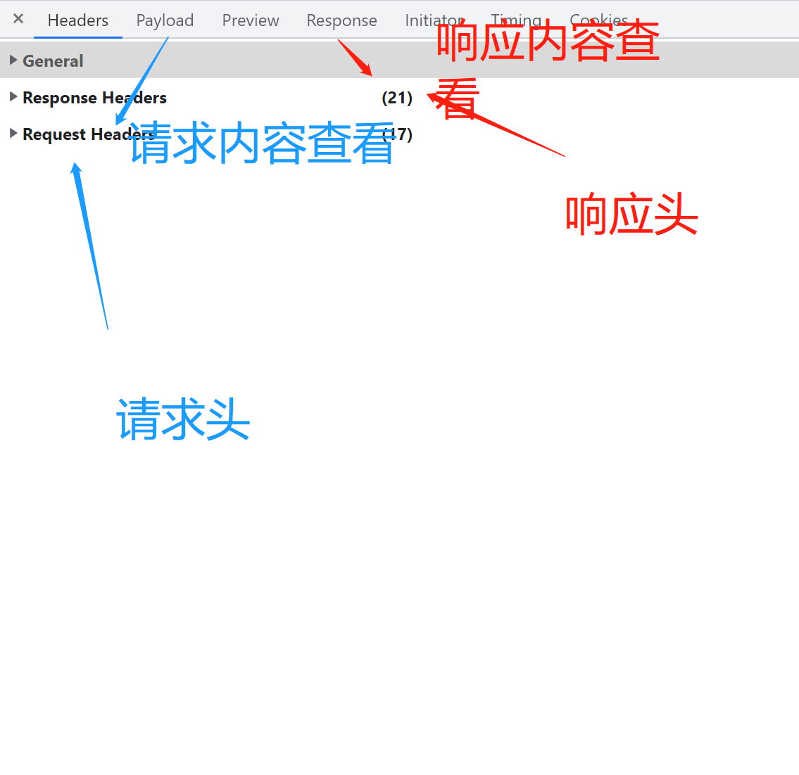

# ajax完整代码、axios安装与封装、api统一管理与页面调用

## Ajax网络请求基础

​
ajax：不刷新页面懒加载（只加载用户需要的）数据|与服务端通信

xml：可自定义标签、存储以及传输数据使用，现在已被json格式取代

html：固定标签，渲染数据

**优点**

与服务器通讯，只加载需要的内容，速度很快

可根据事件（鼠标、键盘等事件）控制与服务器通讯加载内容


**缺点**

seo差 爬虫爬不到这些服务器加载过来的数据

跨域问题： a.com 不能向 b.com 发送请求

没有浏览器回退事件 也没有浏览记录

浏览器F12 调试台 network


## 完整的ajax请求


```js
function ajaxHttpRequestFunc(){
        let xmlHttpRequest;  // 创建XMLHttpRequest对象，即一个用于保存异步调用对象的变量
        if(window.ActiveXObject){ // IE浏览器的创建方式
            xmlHttpRequest = new ActiveXObject("Microsoft.XMLHTTP");
        }else if(window.XMLHttpRequest){ // Netscape浏览器中的创建方式
            xmlHttpRequest = new XMLHttpRequest();
        }
        xmlHttpRequest.onreadystatechange=function(){ // 设置响应http请求状态变化的事件
            console.log('请求过程', xmlHttpRequest.readyState);
            if(xmlHttpRequest.readyState == 4){ // 判断异步调用是否成功,若成功开始局部更新数据
                console.log('状态码为', xmlHttpRequest.status);
                if(xmlHttpRequest.status == 200) {
                    console.log('异步调用返回的数据为：', xmlHttpRequest .responseText);// 打印获取到的数据
          const res = JSON.parse(xmlHttpRequest .responseText) //JSON格式转换
          console.log('JSON.parse(xmlHttpRequest .responseText)',JSON.parse(xmlHttpRequest .responseText));
          mes.value = res.result.note
                } else { // 如果异步调用未成功,弹出警告框,并显示错误状态码
                    alert("error:HTTP状态码为:"+xmlHttpRequest.status);
                }
            }
        }
        xmlHttpRequest.open("GET","请求的完整地址",true); // 创建http请求，并指定请求得方法（get）、url（https://api.oioweb.cn/api/common/OneDayEnglish）以及验证信息
        xmlHttpRequest.send(null); // 发送请求
    }
```

## axios安装
```js
npm install axios
```

## axios封装
```js
 
// api/requests.js
 
import axios from "axios";
 
//1.利用axios对象的方法create,去创建一个axios实例
//2.request1就是axios,只不过稍微配置一下
export const request1 = axios.create({
    //配置对象
    //基础路径，发请求的时候，路径当中会出现api，不用你手写
    baseURL:'https://api.oioweb.cn/api',
    //请求时间超过5秒
    timeout:5000
});
```
## api统一管理
```js
 
// api/index.js
 
import request1 from "./requests";
//导入刚才写好的axios二次封装的requests
 
//发请求：axios发请求返回结果promise对象
export const getOneDayEnglish = () => {
    //由于前面配置了基础路径，所以不用加/api
    return requests({
        url: '/common/OneDayEnglish',
        method: 'get'
    })
};
```

## 组件调取接口
```js
import {getOneDayEnglish} from '../api/index.js'
// 导入刚统一管理导出的api函数
function getEnglish (){
// promise对象 用then获取调取接口的返回值
  getOneDayEnglish().then(response => {
    console.log('response',response);
      })
}   
```


