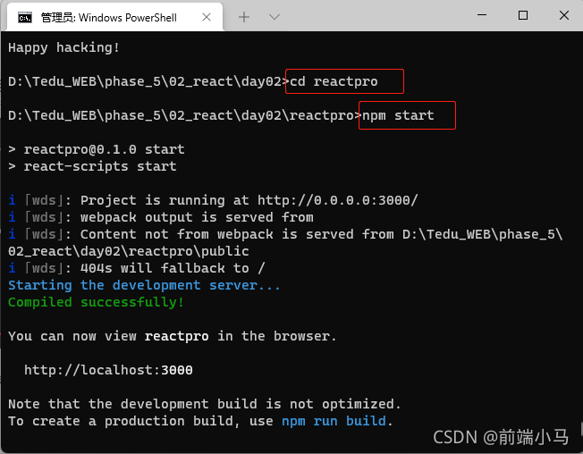

# 创建 React 脚手架项目

## 创建一个新的项目
（1）在创建好的文件夹内打开命令提示行工具，输入命令 npx create-react-app 项目名 创建一个新的项目；

（2）等待一段时间过后会出现成功提示；

（3）按照提示先进入项目名称文件夹 cd reactpro ，然后输入启动命令 npm start ，可以看到开启地址

（4）启动之后会自动在浏览器展示该项目的首页。

