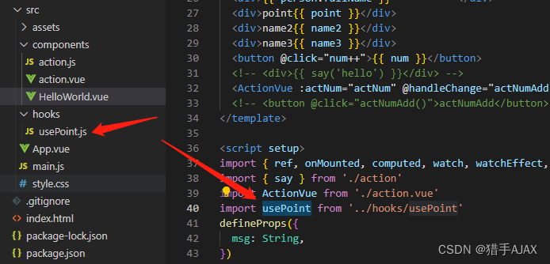

# vue3 常用组合式API(Composition API)总结

## 1.setup顶配函数

### 1.1表单文件*.vue 组合式API setup    
1.组件中所用到的：数据、方法等等，均要配置在setup中    
2.尽量不要与Vue2.x配置混用、如果有重名，setup优先   
3.setup 是在单文件组件 (SFC) 中使用组合式 API 的编译时语法糖。当同时使用 SFC 与组合式 API 时该语法是默认推荐。


```js
<template>
  <button @click="sayHellow">{{ num }}</button>
</template>

<script setup>
const num = 0
console.log('hellow world');
function sayHellow() {
console.log('hellow vue3');
}
</script>
```

## 2.import引入js文件函数

```js
//action.js
export function say (val) {
    console.log('say:', val);
}
```

```js
// HellowWorld.vue
<template>
 <div>{{ say('hello') }}</div>
</template>

<script setup>
import { say } from './action'
say('hello')
</script>
```

## 3.使用*.vue表单文件组件

```js
// action.vue
<template>
    <h1>action</h1>
</template>
  
<script setup>

</script>
  
<style scoped>

</style>
```

```js
// helloWorld.vue
<template>

  <ActionVue  />

</template>

<script setup>

import ActionVue from './action.vue'

</script>

<style scoped>

</style>
```

## 4.父传子 defineProps() 方法
```js
// helloWorld.vue （父组件）
<template>

  <ActionVue  :actNum="actNum"/>

</template>

<script setup>
import { ref } from 'vue'
import ActionVue from './action.vue'
const actNum = ref(0)
</script>

<style scoped>

</style>
```
```js
// action.vue (子组件)
<template>

    <div>{{ actNum }}</div>

</template>
  
<script setup>
const props = defineProps({
    actNum: Number
})
console.log('props.actNum', props.actNum);

</script>
  
<style scoped>

</style>
```

## 5.子传父,子组件调用父组件方法 defineEmits()方法
```js
// action.vue (子组件)
<template>

       <button @click="actChange(1)">actChange</button>

</template>
  
<script setup>
const emits = defineEmits(['handleChange'])
function actChange (num) {
    emits('handleChange',num)
}
</script>
  
<style scoped>

</style>
```
```js
// helloWorld.vue （父组件）
<template>

  <ActionVue  @handleChange="actNumAdd"/>

</template>

<script setup>
function actNumAdd (num) {

  console.log('actNumAdd', num);
}
</script>

<style scoped>

</style>
```
## 6.父组件访问子组件数据和方法，defineExpose()
```js
// action.vue (子组件)
<template>

       

</template>
  
<script setup>
function childFn (val) {
    console.log('子组件方法:', val);
}
const childeMeg = '子组件内容'
defineExpose({
    childFn,
    childeMeg
})
</script>
  
<style scoped>

</style>
```
```js
// helloWorld.vue （父组件）
<template>

  <ActionVue  ref="childeRef"/>

</template>

<script setup>
import {onMounted} from 'vue'

const childeRef = ref()

onMounted(() => {
  console.log('childeRef.value.childeMeg', childeRef.value.childeMeg)
  childeRef.value.childFn('aaaaaa')
})
</script>

<style scoped>

</style>
```
## 7.顶层await
```js
<script setup>
const post = await fetch(`/api/post/1`).then((r) => r.json())
</script>
```

## 8.双向数据绑定，reactive与ref的对比；toRef, toRefs结合reactive的应用
### 从定义数据角度对比：

ref用来定义： 基本数据类型  
reactive用来定义： 对象（或数组）类型数据   
备注： ref也可以用来定义对象（或数组）类型数据，它内部会自动通过reactive转为代理对象
```js
<template>
  <div>name2{{ num }}</div>
  <div>name2{{ name2 }}</div>
  <div>name3{{ name3 }}</div>

</template>

<script setup>
import { ref, reactive, toRef, toRefs } from 'vue'
let num = ref(0)
let human = reactive({
  age: 18,
  name: 'xxx'
})
const name2 = toRef(human, 'name')
const name3 = toRefs(human)
</script>

<style scoped>

</style>
```

## 9.computed函数
computed注重的计算出来的值（回调函数的返回值），所以必须要写返回值
```js
<template>
  <div>{{ person.fullName }}</div>
<button @click=actNumAdd ">actNumAdd </button>
</template>

<script setup>
import { onMounted } from 'vue'

let person = ref({
  firstName: 'aaa',
  lastName: 'bbb'
})

const actNum = ref(0)

function actNumAdd () {
actNum.value = actNum.value + 1
  person.value.fullName = computed(() => {
    return person.value.firstName + '===' + actNum.value + ''
  })

}
</script>

<style scoped>

</style>
```

## 10.watch函数
既要指明监视的属性，也要指明监视的回调
```js
<template>

</template>

<script setup>
import {  watch } from 'vue'
  let sum  = ref(0)
  let msg = ref('你好啊')
  let person = reactive({
                name: '张三',
                age: 18,
                job:{
                    salary: '15k'
                },
            })

 //情况一：监视ref所定义的一个响应式数据
             watch(sum, (newValue,oldValue)=>{
                 console.log('新的值',newValue);
                 console.log('旧的值',oldValue);
             })

            //情况二：监视ref所定义的多个响应式数据
            watch([sum,msg], (newValue,oldValue)=>{
                console.log('新的值',newValue); //['sum的newValue', 'msg的newValue']
                console.log('旧的值',oldValue); //['sum的oldValue', 'msg的oldValue']
            },{immediate: true,deep:true}) //这里vue3的deep是有点小问题的，可以不用deep，（隐式强制deep）

            //情况三：监视reactive定义的所有响应式数据,
            //1.此处无法获取正确的oldValue（newValue与oldValue是一致值）,且目前无法解决
            //2.强制开启了深度监视（deep配置无效）
            /**
            * 受到码友热心评论解释： 此处附上码友的解释供大家参考：
            * 1. 当你监听一个响应式对象的时候，这里的newVal和oldVal是一样的，因为他们是同一个对象【引用地址一样】，
            *    即使里面的属性值会发生变化，但主体对象引用地址不变。这不是一个bug。要想不一样除非这里把对象都换了
            * 
            * 2. 当你监听一个响应式对象的时候，vue3会隐式的创建一个深层监听，即对象里只要有变化就会被调用。
            *    这也解释了你说的deep配置无效，这里是强制的。
            */
            watch(person, (newValue,oldValue)=>{
                console.log('新的值',newValue); 
                console.log('旧的值',oldValue);
            })

            //情况四：监视reactive对象中某一个属性的值，
            //注意： 这里监视某一个属性的时候可以监听到oldValue
            watch(()=>person.name, (newValue,oldValue)=>{
                console.log('新的值',newValue);  
                console.log('旧的值',oldValue);
            })

            //情况五：监视reactive对象中某一些属性的值
            watch([()=>person.name,()=>person.age], (newValue,oldValue)=>{
                console.log('新的值',newValue);  
                console.log('旧的值',oldValue);
            })

            //特殊情况: 监视reactive响应式数据中深层次的对象，此时deep的配置奏效了
            watch(()=>person.job, (newValue,oldValue)=>{
                console.log('新的值',newValue);  
                console.log('旧的值',oldValue);
            },{deep:true}) //此时deep有用


</script>

<style scoped>

</style>
```

## 11.watchEffect函数
不用指明监视哪个属性，监视的回调中用到哪个属性，那就监视哪个属性    

watchEffect更注重的是过程（回调函数的函数体），所以不用写返回值
```js
<template>
   <button @click="actNumAdd()">actNumAdd</button>
</template>

<script setup>
import {  watchEffect ,ref } from 'vue'

let person = ref({
  firstName: 'aaa',
  lastName: 'bbb'
})
const actNum = ref(0)

function actNumAdd (num) {
actNum.value = actNum.value + 1
person.value.fullName = person.value.firstName + '===' + actNum.value + ''

}

watchEffect(() => {
  let fullName = person.value.fullName
  console.log('person.value', person.value.fullName);
  console.log('watchEffect被调用了');
})
</script>

<style scoped>

</style>
```

## 12.生命周期函数
```js
<template>
   
</template>

<script setup>
import { onBeforeMount, onMounted, onBeforeUpdate, onUpdated, onBeforeUnmount, onUnmounted } from 'vue'

//通过组合式API的形式去使用生命周期钩子
            /**
             * beforeCreate 和  created 这两个生命周期钩子就相当于 setup 所以，不需要这两个
             * 
             * beforeMount   ===>  onBeforeMount
             * mounted       ===>  onMounted
             * beforeUpdate  ===>  onBeforeUpdate
             * updated       ===>  onUpdated
             * beforeUnmount ===>  onBeforeUnmount
             * unmounted     ===>  onUnmounted
             */


onBeforeMount(() => {
    console.log('onBeforeMount');
})
onMounted(() => {
    console.log('onMounted');
})
onBeforeUpdate(() => {
    console.log('onBeforeUpdate');
})
onUpdated(() => {
    console.log('onUpdated');
})
onBeforeUnmount(() => {
    console.log('onBeforeUnmount');
})
onUnmounted(() => {
    console.log('onUnmounted');
})


</script>

<style scoped>

</style>
```

## 13.自定义hooks函数

```js
//usePoint.js

function savePoint (val) {
    console.log('savePoint', val);
    return val


}
export default savePoint
```

```js
// HelloWorld.vue
<template>
  
</template>

<script setup>
import usePoint from '../hooks/usePoint'

const point = ref(0)
point.value = usePoint(6)
console.log('usePoint(6)', usePoint(6));

</script>

<style scoped>

</style>
```