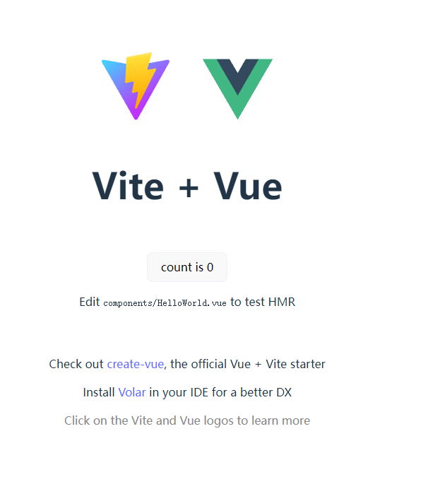

# vite脚手架

## 官网下载​ nodejs

nodejs官网下载 [Nodejs](https://nodejs.org/en)，下载尽可能新的版本并安装


## 安装验证

新建一个空文件夹 并用vscode启动 开始验证 node npm是否安装好

```js
//验证node当前版本
node -v
// 验证npm当前版本
npm -v
```


官网会指出最低版本要求，注意自己的nodejs版本是否符合要求


## 创建项目

### 在空白目录下使用不同工具创建项目

```js
// 用npm创建项目
npm create vite@latest

// 用yarn创建项目
yarn create vite

// 用pnpm创建项目
pnpm create vite


```

### 项目名称
确定项目名称 可以用默认 确定好后 按回车


### 选择框架
选择框架 点击上下选择需要的框架 我们这里选择vue 选择好后 按回车进入下一步


### 选择语言
选择语言 上下选择 这里我们选择js 上下按键选择好后 按回车进行创建项目


### 安装完成
在执行好安装三步后，等待几秒，当左边空白文件出现大量新文件，并终端控制台出现 Done. Now run:

字样时候表示项目已安装完成


## 启动项目
### 进入刚创建好的项目
首先 按照 控制台提示 敲下如下代码 进入刚创建好的项目


### 安装依赖
第二步 执行 npm install 安装依赖


### 启动项目
最后一步 npm run dev 启动项目（以后每一次启动项目 都可以用这个命令）


## 项目启动成功
浏览器出现这样的界面表示viet+js+vue项目创建成功 并且 正常启动 在这个脚手架之内就可以正常开发业务所需要的功能了

