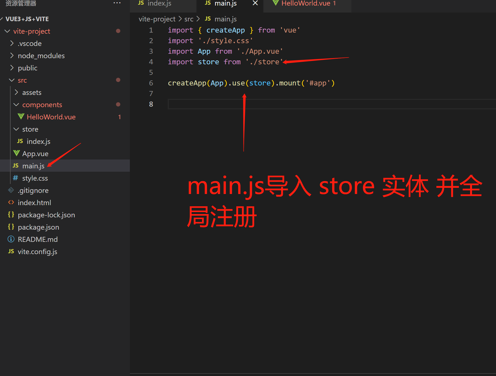

# vue3下的 vuex 安装到使用

## vuex简介

独立于组件库的状态管理器，项目的公用数据可以保存在这个库（State）中，且支持响应式，但只能由Muntation修改，并不意味着将所有状态都放入store中，组件私有的，其他组件使用不到的，非公共状态，就可以不用放入store中

## 安装

```js
// npm 安装
npm install vuex@next --save
// yarn 安装
yarn add vuex@next --save
```
以上 命令行 执行安装几秒后

包管理文件出现 vuex 与 其版本号 表示安装已完成

## 引入
### 创建store文件以及main文件引入
创建 store->index.js文件 并写入如下代码

mian.js导入 store 并全局注册


## State
### State : vuex 中 储存公共数据的方法
```js
// 上文创建的 store下的index.js文件中

import {createStore} from 'vuex'

const store = createStore({
    //共享的数据
    state(){
        return{
            count:0
        }
    },

   
})

export default store
```

整个项目 所有.vue组件 获取到这个公共数据 的两种方法 

**方法一(组合式API)**： store.state.自定义字段名    

在.vue文件中 使用 vuex store state 里的数据 
```js
//任意.vue 文件

<template>
  <div>
    <h1>{{ vuexCount }}</h1>
  </div>
</template>
<script setup>
import { ref ,onMounted} from 'vue'

//从 vuex 引用 useStore 
import {useStore} from 'vuex'

//实体化 useStore() 方法
const store = useStore()

const vuexCount = ref(0)
console.log('store.state.count',store.state.count)
onMounted(()=>{

// 获取 vuex store state 里的 count字段的数据 
  vuexCount.value = store.state.count + 10

})
</script>
```

**方法二：mapState 辅助函数**（当组件需要获取多个状态，并将这些状态加入计算属性的时候）
```js
<template>
  <div>
    <!-- <h1>{{ store.state.count }}</h1> -->
    <h1>{{ count + count1 + count2 }}</h1>
  </div>
</template>
<script>
// 从 vuex 引入 mapState
import { mapState } from 'vuex'
export default {
  
  computed: {
    //在计算属性中 用...拓展多个引入 state中的状态
    ...mapState(['count', 'count1', 'count2'])
  }
}
</script>
```
## Gatter
### Gatter:对state里的数据进行处理，但不改变state里面的数据
在store->index.js里面注册 getters 处理state数据的方法
```js
    //State 共享的数据
    state() {
        return {
            count: 0,
            count1: 1,
            count2: 2,
            countArr: [{
                    a: 'a',
                    num: 10,
                    done: false
                },
                {
                    b: 'b',
                    num: 20,
                    done: true
                },
                {
                    c: 'c',
                    num: 30,
                    done: false
                },
            ]
        }
    },
    // Getter 对 State中的数据进行处理 但不改变其中的数据
    getters: {
        countArrsum(state) {
            return state.countArr[0].num += state.countArr[1].num
        },
        countArrsum1(state) {
            return state.count1 += state.count2
        },
        countArrsum2(state) {
            return state.countArr.filter(todo => todo.done)
        },
        //第二个参数可以传入 已有的getters的状态
        countArrsum3(state, getters) {
            return getters.countArrsum2.length
        },
        //可以调用时候传入参数（数组下标查询数组特别有用）
        getTodoById: (state) => (index) => {
            return state.countArr[index]
        },
    },
```
使用两种方式在任意组建中调用 getters的处理过的数据  
**方法一**：store.getters.getters方法名(传参)

**方法二**：在computed中 使用...mapGetters多个引用


## Mutation
### Mutation:改变state里面数据的唯一方法，只支持同步函数
在store->index.js里面的注册修改state里面数据的方法：mutations
```js
import {
    createStore
} from 'vuex'

const store = createStore({
    //State 共享的数据
    state() {
        return {
            count: 0,
            count1: 1,
            count2: 2,
        }
    },
    // Muntation 修改 state里面数据的唯一方法 只支持同步调用
    mutations:{
        // 变更状态
        add1 (state) {
            state.count1++
          },
        //.vue组件调用传入 Number参数
        add2(state,num){
            state.count2 += num
        },
        //.vue组件调用传入 Object参数
        add3(state,obj){
            state.count2 += obj.num
        }
    }  
})

export default store
```

.vue调用store mutations 里方法的两种方式    
**方式一**：store.commit

**方式二**：mapMutations 引入多个 mutations里面的方法


## Action
### Action:通过提交mutation实现异步操作修改state里的状态

.vue组件里面调用 actions里的两种方法

**方法一**：store.dispatch('方法名'，传值)

**方法二**：mapActions({组件方法名：‘actions里方法名’})；mapActions（[‘actions里方法名’]）

